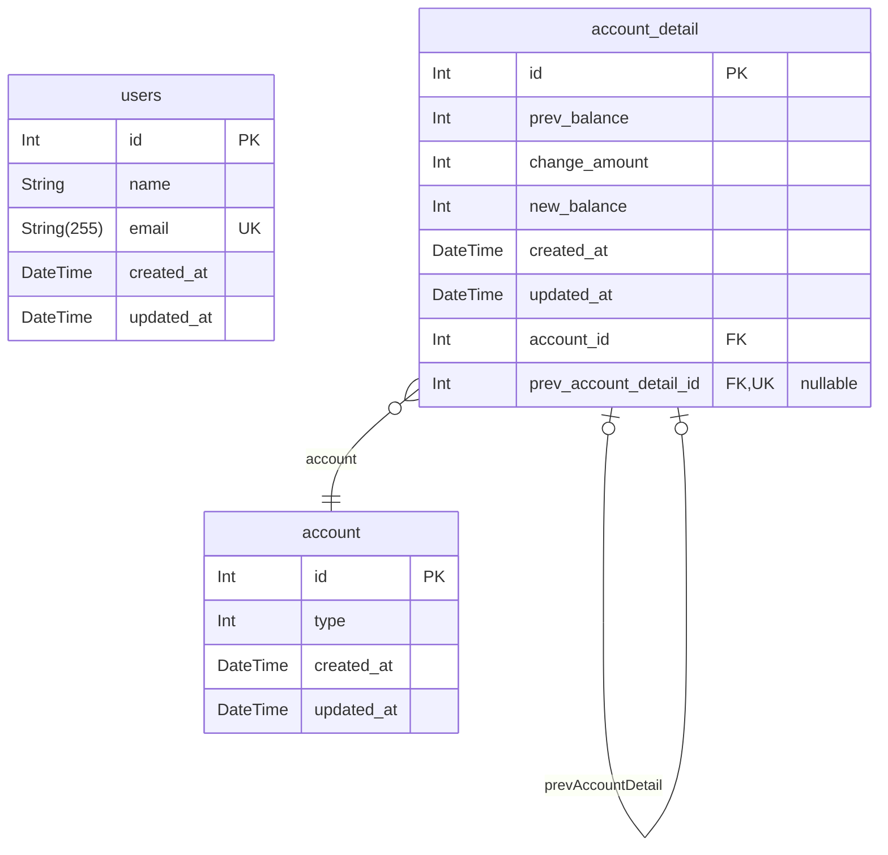

# Concurrency

## erd

### purchaseNoTrasaction

- 가장 최근 계좌 내역 조회(createdAt 기준 정렬)
- 새로운 계좌 내역 생성
- 조회, 생성 간 하나의 트랜잭션으로 관리 x

### purchaseNoTrasaction.test

1. 일반적인 사용 내역 추가
2. 잔액이 부족한 경우
3. 10 회 수행했을 때 성공한 횟수 만큼 금액 차감
   - prev_acount_detail_id 의 unique constraint 문제 발생
   - 여러 요청에서 동일한 데이터를 참조하고 있음을 확인할 수 있음

### purchaseReadCommitted

- 트랜잭션 오픈(read committed)
- 가장 최근 계좌 내역 조회(createdAt 기준 정렬)
- 새로운 계좌 내역 생성
- 트랜잭션 커밋

### purchaseReadCommitted.test

1. 일반적인 사용 내역 추가
2. 잔액이 부족한 경우
3. 10 회 수행했을 때 성공한 횟수 만큼 금액 차감
