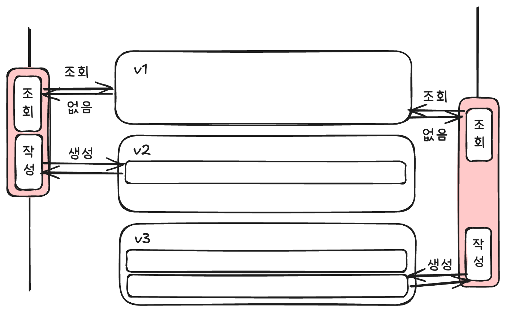
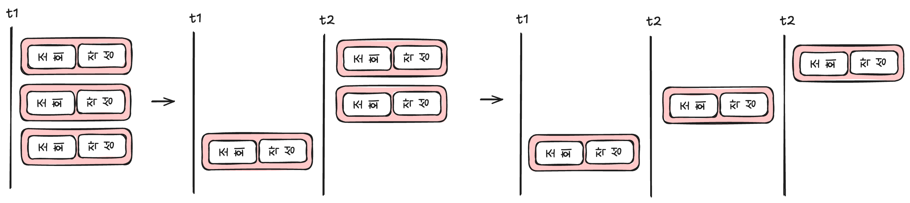

## 문제 상황

게시글을 한 사용자가 한 시간에 하나 작성할 수 있습니다(이전 작성 시간부터 한 시간이 아닌 18:00 ~ 18:59 에 하나와 같은 형태).
특정 시간의 게시글 조회, 있으면 작성하지 않고 없으면 작성하는 단계로 로직을 구성하였습니다. 별다른 방어 로직이 없어 두 개의 기기로 접속하여 요청하는 등의 간단한 방법으로 두 개 이상의 글을 작성할 수 있습니다.
또한 게시글을 작성한 이후 추가 작업이 생겼습니다. api 에 포함되는 작업의 시간이 길어지면 버그 성공률이 높아지기 때문에 이를 방지할 수 있는 방법을 찾아보게 되었습니다.

## 문제 원인

게시글 작성의 내부에는 조건에 맞는 게시글 조회, 게시글 작성의 두 단계로 나뉘어 있습니다.
여러 개의 게시글 작성 요청이 발생해 조건에 맞는 게시글을 조회하면 여러 요청에서 게시글이 존재하지 않는다고 생각하게 됩니다. 따라서 한 개 이상의 요청에서 게시글 작성을 수행합니다.
제약 조건이 따로 걸려있지 않는 한 동일 시간대에 여러 개의 게시글을 작성할 수 있게 됩니다.


요청은 트랜잭션과 동일하지 않습니다. 필요에 따라 하나의 트랜잭션으로 묶을 수도 있습니다.
- 동일 유저가 여러 요청을 보낸 경우(동시에 여러 기기에서 한 계정을 사용하는 경우, 혹은 한 기기에서 여러 요청이 발생하는 경우, 혹은 토큰을 첨부한 무작위 공격 등)
- 여러 요청이 v1 상태의 데이터를 확인합니다. 따라서 v1 의 데이터를 조회한 요청들은 게시글을 작성한 이력이 없다고 판단하게 됩니다.
- 동일 시간대에 게시글을 작성한 이력이 없다고 판단한 요청들은 게시글 작성 요청을 DB 에 보냅니다. 별다른 오류가 발생하지 않는다면, 요청이 처리되는 순서대로 데이터가 생성됩니다(가장 먼저 처리된 요청으로 인해 v2 상태로 변화하고, 이후 v3 ... 상태로 변화합니다).
- 동시 요청에 대한 여러 개의 게시글이 생성될 수 있습니다.

## 예상 문제 해결 방안



조건에 맞는 게시글의 존재 여부와 같은 경우는 없던 행이 생깁니다. Serializable 이 아닌 트랜잭션을 이용해선 새로 생기는 데이터에 대해서 막지 못합니다.
따라서 게시글 작성 작업을 하나로 묶어줄 수 있어야 합니다(원자적 수행).

## 예상 해결 방법

트랜잭션 내부에선 특정 시간의 사용자의 게시글을 조회합니다. 이후 게시글 존재 여부에 따라 게시글을 작성합니다.
두 가지 로 나누어진 작업을 원자적으로 실행할 수 있도록 구성해야 합니다. 몇 가지 방법을 떠올릴 수 있습니다.

- 트랜잭션 격리 수준을 `Serializable` 로 설정하여 실행한다.
- DB 의 row-level lock 을 이용한다.
- DB 의 advisory lock 을 이용한다.
- Redis 를 활용한 유사 락을 이용한다.
- Queue 를 활용할 수 있지 않을까(이건 안해봤습니다)? -> 결국엔 큐에서 중복을 제거하거나 컨슈머에 여러 번 전달되지 않아야 하기 때문에 락을 사용하거나 중복 제거 과정이 필요할 것으로 보임. 단 한번의 실행을 보장하는 것은 어려운 일!

### 트랜잭션 격리 수준을 `Serializable` 로 설정하여 실행

`Serializable` 은 트랜잭션 간 충돌을 허용하지 않아 순차적으로 실행됩니다. 따라서 원자성을 확보하여 게시글 여러 개가 작성되는 것을 방지할 수 있습니다.
하지만, 트랜잭션을 하나씩 수행하기 때문에 요청이 많아지면 매우 느려질 수 있습니다(트랜잭션이 처리되는 시간보다 트랜잭션이 들어오는 속도가 더 빠르다면 트랜잭션은 쌓이게 됩니다. 이는 대기 시간을 발생시키기 때문에 서버와 DB 간 연결이 끊겨 연산이 제대로 수행되었는지 알 수 없습니다.
Prisma 에서는 `Serializable` 을 사용하면 경고였나 에러가 발생하는 것으로 기억하고 있습니다.

### unique 제약조건을 활용

특수한 조건으로 인해 시간 조건이 있습니다. 따라서 `2025-10-28 21:00:00.000` 과 같은 타임과 `userId` 에 제약조건을 걸 수 있는 새로운 테이블을 생성하거나 기존 테이블을 변형할 수 있습니다.
해당 제약조건은 생성 시점에 체크를 하기 때문에 앞의 조회에서 중복 요청을 잡아내지 못하더라도 제약조건에 의해 게시글 생성이 중복 발생하지 않습니다.

장점
- 매우 간단하게 해결할 수 있다는 장점이 있습니다.

단점
- 매우 특수한 조건에서 작용합니다. 만약 작성 시점 한 시간 내로 요구사항이 변경된다면, 동일한 방식의 제약조건으론 동시성 문제를 해결할 수 없습니다.
- 만약 두 개의 테이블로 분리하여 진행하는 경우 두 개의 테이블에 생성 연산이 발생하는 것이기 때문에 연산 시간이 길어지는 단점이 있습니다.

### DB 의 `row-level lock` 활용

PostgreSQL 에는 row-level lock 이 네 가지 존재합니다. 이 중 for update 에 대한 락은 베타 락을 이용하여 다른 트랜잭션에서 update 작업을 수행하는 것을 방지할 수 있습니다.
하지만 이 케이스에서 시간을 기준으로 `select ~ for update` 를 잡아도 원자성을 보장할 수 없습니다. 그 이유는 lock 이 걸린 row 가 없기 때문입니다. insert 는 행이 생성되는 행위이므로 시간 단위의 락을 거는 것으로 문제를 해결할 수 없습니다.

살짝 우회하는 방법을 사용해야합니다. `userId` 에 해당하는 user 테이블의 row 에 락을 걸고 이후의 과정을 진행합니다.

```sql
begin;
select id from users where id = '~~' for update;
select id from posts where user_id = '~~';
-- 없으면 insert, 있으면 rollback
insert into posts (title, content);
commit;
```

`select ~ for update` 끼리는 서로 부딪히기 때문에 다른 트랜잭션에서 게시글 작성하는 것은 `users` 테이블의 row-level lock 을 획득할 때까지 대기합니다.
해서 원자성을 보장할 수 있습니다.

장점
- 비교적 간단하게 해결 가능합니다.

단점
- 실제로 관련이 있지 않은, 다른 곳에서 많이 사용될 수 있는 `users` 테이블에 락을 사용하여 사이드 이펙트가 발생할 확률이 높습니다(만약 users 데이터를 업데이트 하는 과정이 동시에 발생한다면 대기하는 과정이 필요합니다).
- DB 의 리소스를 사용해야 합니다.

### DB 의 advisory lock 활용

PostgreSQL 에는 advisory lock 이 존재합니다. 특정 int32 / int64 숫자에 대해 락을 걸 수 있습니다. 게시글 작성 이벤트를 동일한 유저가 수행할 때 동일한 숫자로 표현할 수 있다면, 해당 락을 이용하여 원자적으로 게시글 작성 요청을 수행할 수 있습니다.
락을 획득, 게시글 조회, 게시글 작성의 순서로 연산을 수행합니다. 이때 중요한 것은 락을 획득하는 함수가 int64, (int32, int32) 두 형태의 인자만 받는다는 점을 유의해야합니다. 해싱 등의 다양한 방법으로 특정 유저가 발생시키는 이벤트를 거의 1 : 1 함수를 만족할 수 있어야 합니다.

```sql
begin;
select pg_advisory_xact_lock(int 형 숫자);
select id from posts where user_id = '~~';
-- 없으면 insert, 있으면 rollback
insert into posts (title, content);
commit;
```

해당 함수는 트랜잭션 단위의 락이다. 따라서 트랜잭션이 종료되면 락이 해제된다고 한다.

장점
- 간단하게 해결 가능합니다.

단점
- int 형태로만 락을 걸 수 있어서 불편합니다.
- DB 의 리소스를 사용해야 합니다.

논외
- 스케일 아웃을 했을 때 락이 공유 되는지 확인되지 않았습니다. 공식 문서에서 관련 언급이 있는데, 정확히 이해가 되지 않아서 따로 확인이 필요합니다.

### Redis 를 이용하여 락을 구현하여 활용

redis 의 set 명령어의 옵션 중 nx 옵션을 이용하여 키에 해당하는 값이 존재할 때 값을 저장하지 않는 성질을 이용할 수 있습니다.
이를 락과 유사하게 이용할 수 있습니다. 만약 set 에 성공하였다면 해당 key 에 대해 lock 을 획득한 것이고 set 에 실패하면 key 에 대해 lock 획득을 실패한 것입니다.
lock 을 획득한 트랜잭션은 이후의 조회 및 생성 연산을 수행하고, lock 을 획득하지 못한 트랜잭션은 lock 을 획득할 때까지 대기합니다(저는 무한 루프를 돌아 획득할 때까지 대기할 수 있도록 구성하였습니다).

장점
- DB 에 부하가 걸리는 것을 방지할 수 있습니다.

단점
- 새로운 관리 포인트가 발생합니다.
- 락을 획득할 때까지 대기하며 락을 요청하는 작업을 반복하는 것이 Redis 에 부하를 발생시킬 수 있습니다(유사한 형태의 락을 스핀 락이라고도 하는 것 같습니다). -> 이는 부하를 줄일 수 있는 방법이 있습니다.
- Node.js 진영에선 라이브러리가 maintain 되고 있지 않아서 직접 구현해야 합니다(단순하게 만드는 것은 금방 하지만, 정교한 방식으로 만드는 것은 시간이 걸립니다).

## 테스트

k6 를 이용하여 테스트를 진행하였습니다. 50 명의 가상 유저가 총 50 회의 요청을 발생하도록 하였습니다. 최대한 동시에 요청이 발생해야한다고 생각하였기에 여러 명이 1번 이상 요청을 빠르게 생성하도록 하였습니다.
prisma 에서 커넥션 풀을 프로세스마다 5개를 열어놓도록 설정하고, pm2 를 이용하여 여러 서버를 동시에 실행하는 것과 유사하게 실험 환경을 구성하였습니다.

```shell
k6 run test/concurrency/post-concurrency1.js
```

위의 명령어를 통해 k6 스크립트를 실행할 수 있습니다. 이후 요청 성공률과 DB 에 저장된 결과를 확인합니다.


## 문제 해결과는 관련 없지만, 귀찮은 것들

- [ ] prisma sql 파일 머지하는 것 -> 컨테이너 생성 시 sql 파일 실행하는 것이 아닌 migrate 를 매번 실행하는 것으로
- [x] docker compose 시 seeding -> 컨테이너 띄운 후 seeding 파일 실행하는 것으로 변경
- [x] 테스트 수행 수 데이터 클렌징
- [x] 테스트 수행하면 커넥션 max 넘는 것으로 보임. 해결할 수 있는 방법


```shell
SELECT * from pg_stat_activity;

select * from pg_settings;

delete from users;
set session_replication_role  = origin;
select * from pg_settings where name = 'session_replication_role';

select * from pg_locks;
```

## 실험을 진행하며 마주한 실수 및 궁금증

- 3 번 예제에서 post 생성 시 transaction timeout 발생. 원인 파악 필요.. -> 이전 버전의 build 애플리케이션을 사용함으로 발생한 문제로 보임. pm2 를 사용하지 않고 새로 빌드한 하나의 애플리케이션으로 실행하도록 변경하여 해결
- pm2 사용법, pm2 새로운 빌드 파일로 실행하는 방법 - 잘 적용이 안되는 것으로 보임, pm2 로드밸런싱 확인
- 스파이크 트래픽에서의 로드 밸런싱이 어떻게 이루어지는지 확인 필요
- 트랜잭션이 끝나지 않았는데 서버와 DB 접속이 끊기는 상황 확인. 아마 트랜잭션이 알아서 종료될 것으로 보인다.

## 코드를 작성하며 참조한 자료들
 
개념적인 내용이 아닌 코드를 작성하며 어떻게 작성할 지 확인한 자료들이다.

https://gist.github.com/lgtome/e05973fe289bef32ca5ccaa0247fe7ee
https://dev.to/lgtome/nestjs-prisma-logs-4926
https://github.com/prisma/prisma/discussions/14743
https://www.postgresql.org/message-id/1314444596.2349.7.camel%40vanquo.pezone.net

