# Configure Access to Multiple Clusters

### requirements
- docker desktop 
- minikube

minikube 를 별다른 설정 없이 사용할 경우 기본 설정 파일이 생성됩니다.
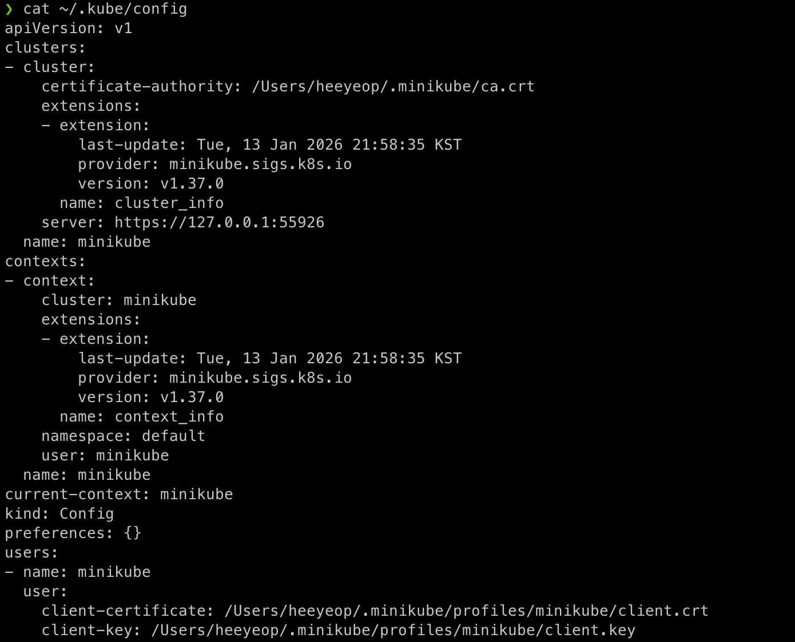

context(디폴트 : ~/.kube/config 기준)


### 주의할 점
- 경로를 주의해야 합니다. 절대 경로가 아닌 경우 pwd 를 기준으로 상대 경로로 인식됩니다. -> `./config-exercise/config-demo`, `./config-exercise/config-demo2`.
- kubeconfig 옵션을 따로 설정하지 않는 경우 기본 경로($HOME/.kube/config)를 기준으로 인식합니다.

### 실행
1. config file 생성

```shell
mkdir config-exercise && cd $_
touch config-demo
```

config-demo 파일의 내용
```yaml
apiVersion: v1
kind: Config
preferences: {}

clusters:
- cluster:
  name: development
- cluster:
  name: test

users:
- name: developer
- name: experimenter

contexts:
- context:
  name: dev-frontend
- context:
  name: dev-storage
- context:
  name: exp-test
```

2. 클러스터 내 세부 설정 추가(endpoint, 인증 정보 등)

```shell
kubectl config --kubeconfig=config-demo set-cluster development --server=https://1.2.3.4 --certificate-authority=fake-ca-file
kubectl config --kubeconfig=config-demo set-cluster test --server=https://5.6.7.8 --insecure-skip-tls-verify
```

3. 사용자 인증 정보 추가

```shell
kubectl config --kubeconfig=config-demo set-credentials developer --client-certificate=fake-cert-file --client-key=fake-key-seefile
kubectl config --kubeconfig=config-demo set-credentials experimenter --username=exp --password=some-password
```

4. context 정보 추가
```shell
kubectl config --kubeconfig=config-demo set-context dev-frontend --cluster=development --namespace=frontend --user=developer
kubectl config --kubeconfig=config-demo set-context dev-storage --cluster=development --namespace=storage --user=developer
kubectl config --kubeconfig=config-demo set-context exp-test --cluster=test --namespace=default --user=experimenter
```

5. config file 확인
```shell
kubectl config --kubeconfig=config-demo view
```

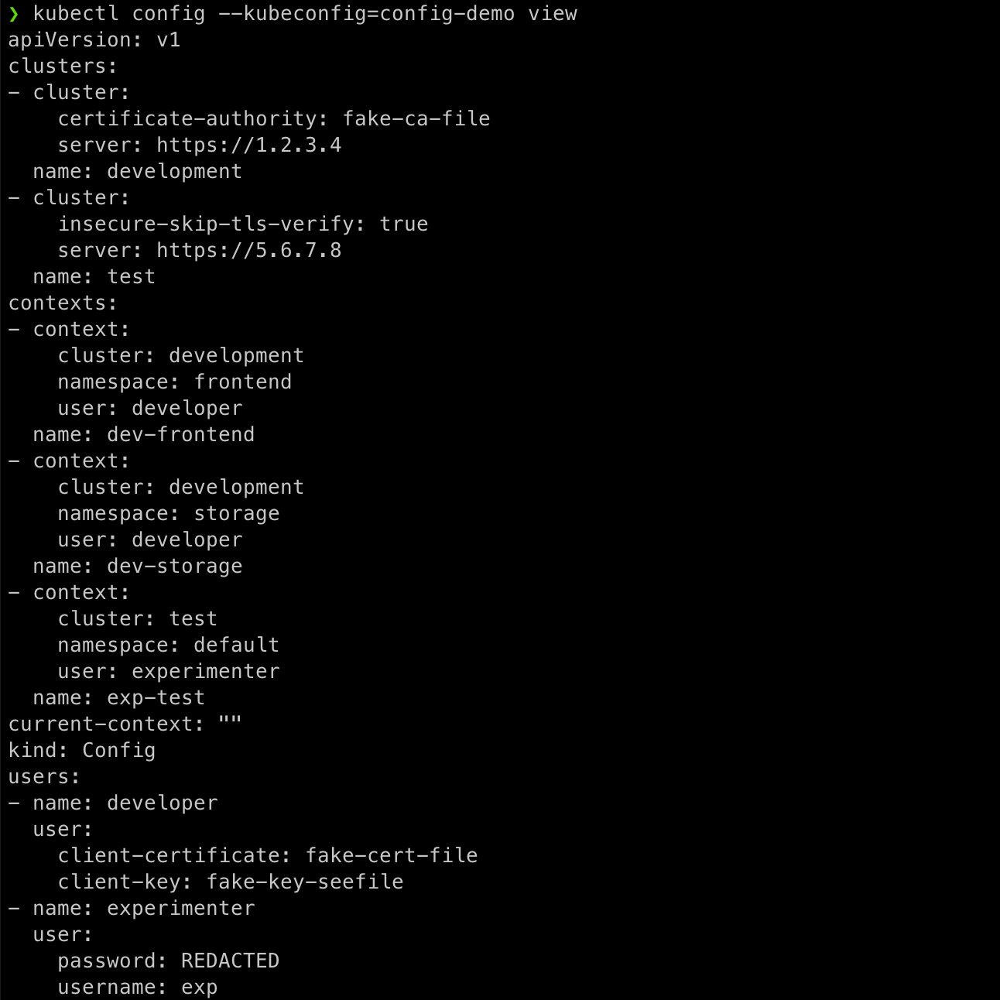

cluster, user, context 정보가 추가되었음을 알 수 있다.

6. context 조회
```shell
kubectl config --kubeconfig=config-demo get-contexts
```
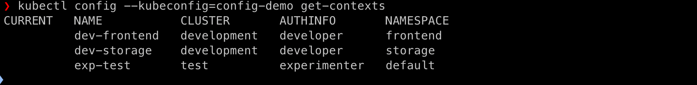

7. context 선택 및 확인
```shell
kubectl config --kubeconfig=config-demo use-context dev-frontend
```

```shell
kubectl config --kubeconfig=config-demo view --minify
```

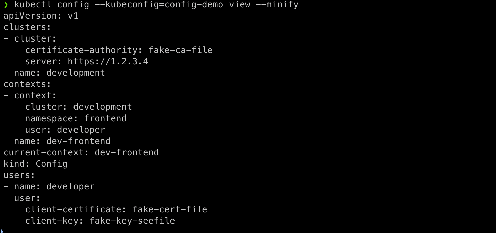

전체 config 파일의 내용 중 dev-frontend context에 대한 정보만 출력됩니다.

8. 새로운 config file 생성
```shell
touch config-demo2
```

```yaml
apiVersion: v1
kind: Config
preferences: {}

contexts:
- context:
    cluster: development
    namespace: ramp
    user: developer
  name: dev-ramp-up
```

9. 새로운 config file 인식 확인
```shell
kubectl config --kubeconfig=config-demo view
kubectl config --kubeconfig=config-demo2 view
kubectl config --kubeconfig=config-demo2 get-contexts
```

기존 config 파일 확인 결과
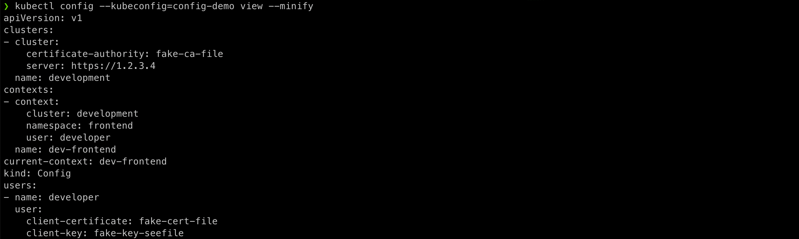

새로운 config 파일 확인 결과
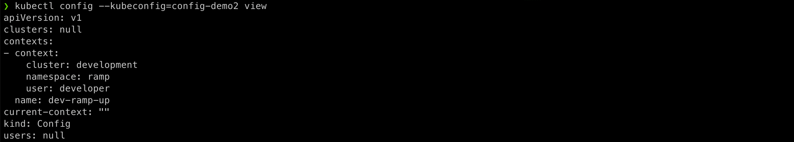

새로운 config 파일의 context 확인 결과


### kubectl 의 config 파일 인식 확인

[공식문서](https://kubernetes.io/docs/concepts/configuration/organize-cluster-access-kubeconfig/#the-kubeconfig-environment-variable) 에 default config file path 를 확인할 수 있다(`${HOME}/.kube/config`).

1. 기존 경로 확인(KUBECONFIG)
```shell
echo $KUBECONFIG
```

환경 변수 확인 결과


설정되어 있는 경우 아마 `${HOME}/.kube/config` 의 형태로 등록되어 있을 것으로 보인다.

2. 기본 config 파일의 context 확인
```shell
kubectl config get-contexts
```

디폴트 context 확인 결과


3. 환경 변수에 기본 경로 추가
```shell
export KUBECONFIG=${HOME}/.kube/config
```

4. context 확인
```shell
kubectl config get-contexts
```

context 확인 결과


동일한 config file 을 인식함을 알 수 있습니다(기본값과 동일).

## 여러 개의 config file 을 사용하는 경우
- config file 의 경로를 모두 KUBECONFIG 환경 변수에 등록한다. delimeter 는 `:` 이다.
- `${HOME}/.zshrc` 파일에 export 명령어를 추가하여 zsh 이 실행될 때마다 환경 변수를 설정하도록 한다.

### KUBECONFIG 환경 변수 추가

편의상 config file 을 몰아두었습니다(환경 변수에 추가하는데 너무 길어서).

0. config file 복사
```shell
cp * ${HOME}/.kube/
```

config 파일 복사 결과
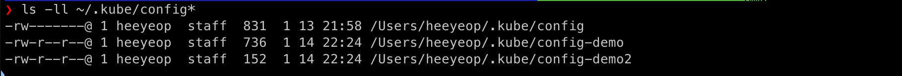

`${HOME}/.kube/` 디렉토리에 config 파일이 복사된 것을 확인할 수 있다.

1. KUBECONFIG 환경 변수에 config file 추가(현재 KUBECONFIG 가 unset 된 상태)
```shell
export KUBECONFIG="${KUBECONFIG}:${HOME}/.kube/config-demo:${HOME}/.kube/config-demo2"
```

2. context 확인
```shell
kubectl config get-contexts
```

context 확인 결과
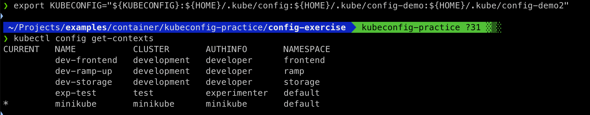

- `minikube` ->  `$HOME/.kube/config` 파일
- `dev-frontend`, `dev-storage`, `exp-test` -> `$HOME/.kube/config-demo` 파일
- `dev-ramp-up` -> `$HOME/.kube/config-demo2` 파일

세 파일의 context 정보를 병합한 결과를 확인할 수 있다.


### 환경 변수를 사용하는 경우 추가 설정
export 를 이용하여 환경 변수를 추가했을 때 terminal 을 종료하거나 새로운 세션을 열면 환경 변수가 초기화 된다. 이를 방지하기 위해 zsh 이 실행될 때마다 실행하는 .zshrc 파일에 export 명령어를 추가하여 사용한다.

```shell
echo "export KUBECONFIG=${HOME}/.kube/config:${HOME}/.kube/config-demo:${HOME}/.kube/config-demo2" >> ~/.zshrc
```

zshrc 파일 설정 후 확인 결과
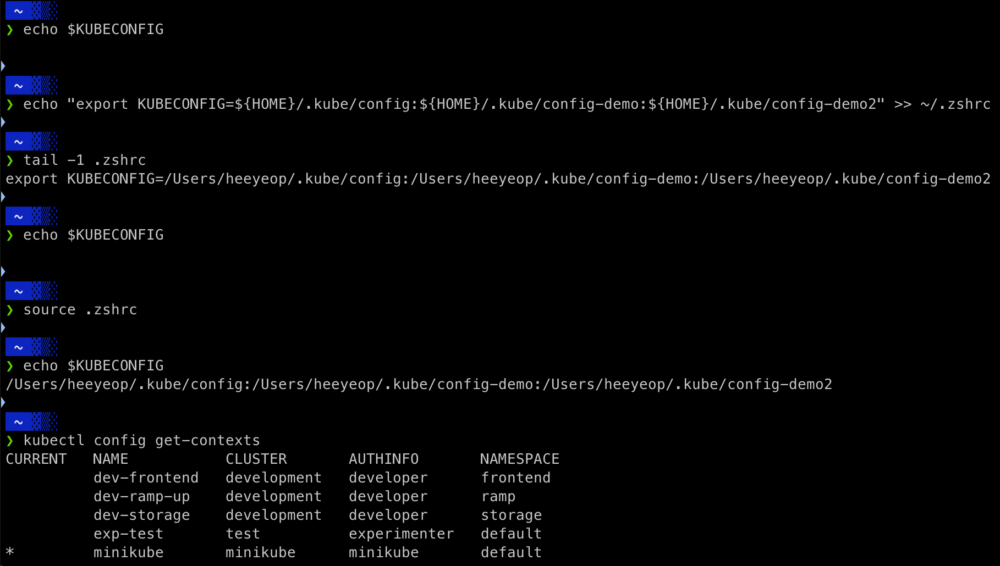

> source 는 현재 shell 에서 .zshrc 파일을 다시 읽기 위한 명령어

## 하나의 config file 을 사용하는 경우

0. 환경 변수 초기화 혹은 디폴트 상태로 설정

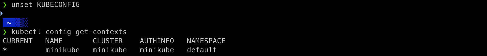

1. 디폴트 config 파일에 cluster, user, context 정보 추가

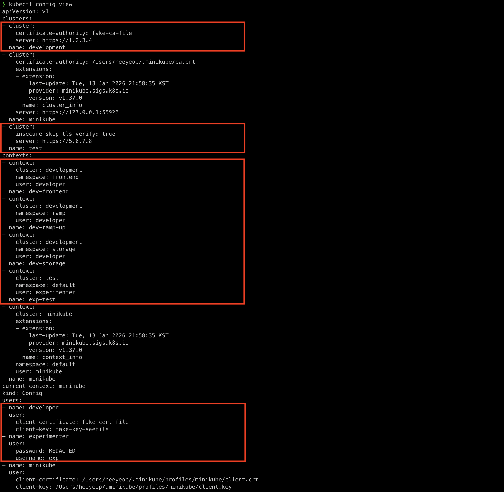

2. context 확인

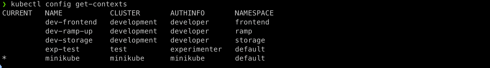

### 추가 - K9S 를 사용할 때 context 적용

위와 같이 context 를 설정하면 k9s 를 사용할 때 context 정보를 사용할 수 있다(혹은 --kubeconfig 플래그로 kubectl 과 유사하게 사용할 수 있다).

```shell
k9s --context minikube
```

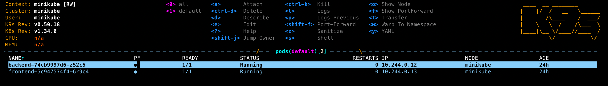

```shell
k9s --context dev-frontend
```
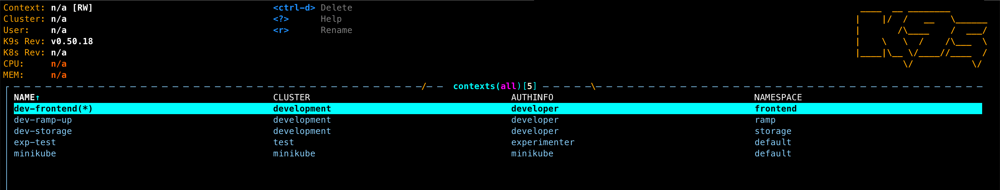

dev-frontend 에서 설정한 서버에 연결이 되지 않아 context 화면을 보여준다. 해당 화면에선 config 파일에 정의한 context 를 확인할 수 있다.

### minikube 에서 새로운 context 생성 후 namespace 적용 확인

1. namespace 생성
```shell
kubectl create namespace hello-world
```

2. config 에 namespace 를 hello-world 사용하는 context 추가

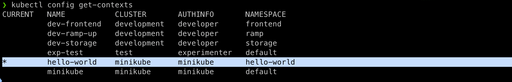

3. context 사용
```shell
kubectl config use-context hello-world
```

4. deploy 배포
```shell
kubectl create deployment hello-node --image=registry.k8s.io/e2e-test-images/agnhost:2.53 -- /agnhost netexec --http-port=8080
```

5. deployment 확인
```shell
kgd -A
kubectl get deployment -A
```

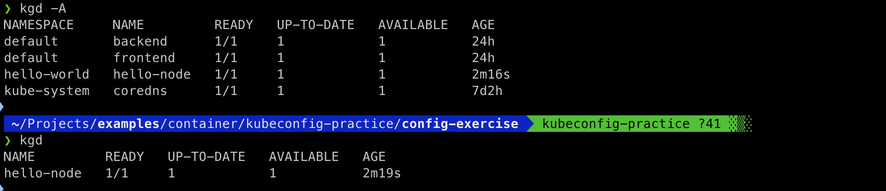

context 에서 지정한 `hello-world` namespace 에서 deployment 가 생성된 것을 확인할 수 있다.


### 참고자료
[공식문서](https://kubernetes.io/docs/tasks/access-application-cluster/configure-access-multiple-clusters/)
[cheat sheet](https://kubernetes.io/ko/docs/reference/kubectl/cheatsheet/)