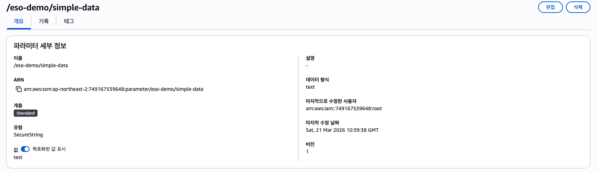
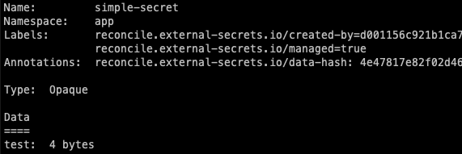
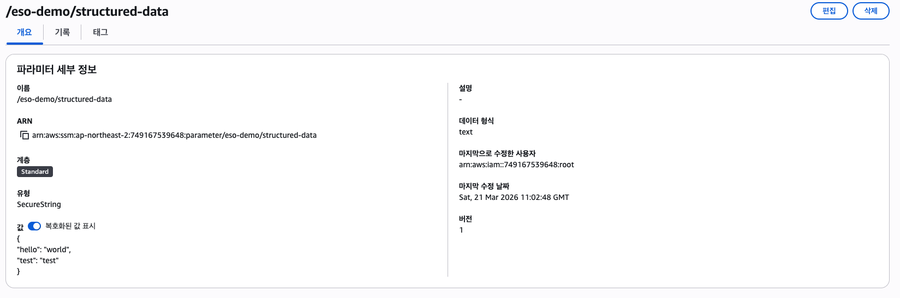
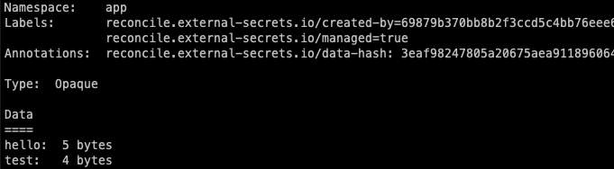
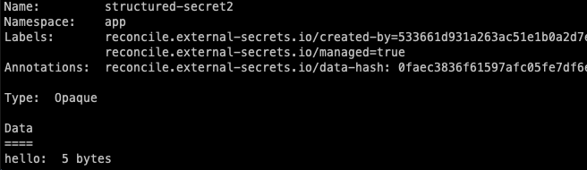

# External Secrets Operator (ESO)

## 1. ESO 간단 소개
External Secrets Operator (ESO)는 Kubernetes 환경에서 외부 Secret 관리 시스템(예: AWS Parameter Store, AWS Secrets Manager, HashiCorp Vault, Google Secret Manager 등)과 통신하여 Secret 데이터를 안전하게 가져와 Kubernetes 내부의 `Secret` 리소스로 자동 동기화해주는 Kubernetes Operator입니다. 이를 통해 소스 코드나 Git 리포지토리에 민감한 정보를 저장하지 않고도, 외부의 안전한 중앙 집중식 Secret 저장소를 활용할 수 있습니다.

## 2. ESO의 기능
* **다양한 프로바이더 지원**: AWS, GCP, Azure, HashiCorp Vault 등 수많은 외부 Secret 관리 솔루션과 통합 가능합니다.
* **동적 동기화**: 외부 저장소의 Secret 값이 변경되면 설정된 주기에 따라 자동으로 Kubernetes `Secret`을 업데이트하여 최신 상태를 유지합니다.
* **템플릿(Templating) 제공**: 단순히 값을 복사하는 것 외에도, 가져온 Secret 값을 기반으로 특정 포맷(JSON, YAML 등)으로 변환하거나 조합하여 Kubernetes `Secret`을 생성할 수 있습니다.
* **보안 및 권한 분리**: 애플리케이션 개발자는 `ExternalSecret` 리소스만 정의하고, 클러스터 관리자는 `ClusterSecretStore`를 통해 인증 및 접근 권한을 중앙에서 관리하도록 역할을 분리할 수 있습니다.
* **PushSecret 지원**: Kubernetes 내부에 있는 Secret을 외부 저장소(예: AWS Parameter Store)로 푸시하여 동기화하는 기능도 제공합니다.

## 3. ESO의 아키텍처
ESO는 크게 3가지의 핵심 Custom Resource(CR)와 하나의 Controller로 구성되어 있습니다.
1. **SecretStore / ClusterSecretStore**: 외부 Secret 제공자(Provider)와 통신하기 위한 인증 정보 및 설정을 정의합니다. `SecretStore`는 특정 네임스페이스에 종속되며, `ClusterSecretStore`는 클러스터 전체에서 공유하여 사용할 수 있습니다.
2. **ExternalSecret**: 어떤 외부 Secret 데이터를 가져와서, 어떻게 Kubernetes `Secret`으로 만들 것인지를 선언하는 리소스입니다. 내부적으로 `SecretStore`를 참조합니다.
3. **PushSecret**: (선택적) Kubernetes 내부의 Secret을 외부 Provider로 내보낼 때 사용하는 리소스입니다.

* **Controller**: 위 CR들을 감시하며, 외부 저장소의 API를 호출하여 데이터를 가져오거나(PushSecret의 경우 푸시) K8s Secret을 생성하는 등의 Reconciliation 루프를 수행합니다.

---

## 4. 튜토리얼 (AWS Parameter Store 기준)

이 튜토리얼에서는 AWS Systems Manager (SSM) Parameter Store를 외부 저장소로 활용하여 Secret을 가져오고(Push/Pull) 동기화하는 가장 간단한 방법을 소개합니다.

### 4.1. 사전 세팅

**1) AWS IAM Role (IRSA) 설정**

K8s 클러스터(EKS 등) 내의 ESO 파드가 AWS Parameter Store에 접근할 수 있도록 IAM Role for Service Accounts (IRSA) 방식으로 권한을 부여하는 것이 권장됩니다.
Parameter Store 접근에 필요한 최소 권한(Least Privilege)을 부여하기 위해 다음과 같이 **IAM Policy(정책)**를 생성합니다.

**IAM Policy (JSON) 예시 - Pull 및 Push 권한 포함:**
```json
{
    "Version": "2012-10-17",
    "Statement": [
        {
            "Effect": "Allow",
            "Action": [
                "ssm:GetParameter",
                "ssm:GetParameters",
                "ssm:GetParametersByPath",
                "ssm:PutParameter",
                "ssm:DeleteParameter",
                "ssm:AddTagsToResource",
                "ssm:ListTagsForResource"
            ],
            "Resource": [
                "arn:aws:ssm:ap-northeast-2:749167539648:parameter/eso-demo/*"
            ]
        }
    ]
}
```
*(주의: `Resource` ARN의 리전, AWS 계정 ID, 파라미터 경로를 실제 환경에 맞게 수정해야 하며, 읽기 전용으로만 사용한다면 `PutParameter`, `DeleteParameter`는 제거해도 됩니다.)*

정책을 생성한 후, Kubernetes의 ServiceAccount와 연결되는 IAM Role을 생성합니다. `eksctl`을 사용하면 Role 생성, Trust Relationship 설정(OIDC), K8s ServiceAccount 생성을 한 번에 수행할 수 있습니다.

**eksctl을 이용한 IAM Role 및 K8s ServiceAccount 생성 명령어 예시:**
```bash
eksctl create iamserviceaccount \
  --name eso-sa \
  --namespace default \
  --cluster my-eks-cluster \
  --attach-policy-arn arn:aws:iam::123456789012:policy/MyESOParameterStorePolicy \
  --approve
```

> *참고: 테스트 환경이거나 IRSA를 사용할 수 없는 경우, AWS Access Key와 Secret Key를 직접 K8s Secret으로 생성하여 SecretStore의 인증 방식으로 매핑할 수도 있습니다.*

**2) ESO 설치**
Helm을 이용해서 ESO를 클러스터에 기본 설치합니다.
```bash
helm repo add external-secrets https://charts.external-secrets.io
helm install external-secrets external-secrets/external-secrets \
    -n external-secrets --create-namespace \
    --set installCRDs=true
```

**3) SecretStore 생성**
AWS Parameter Store와 통신할 `SecretStore`를 정의합니다. (아래 예시는 IRSA가 적용된 환경을 가정합니다.)

```yaml
apiVersion: external-secrets.io/v1beta1
kind: SecretStore
metadata:
  name: aws-parameter-store
  namespace: default
spec:
  provider:
    aws:
      service: ParameterStore
      region: ap-northeast-2
      auth:
        jwt:
          serviceAccountRef:
            name: "eso-sa" # IRSA로 생성 및 연동된 ServiceAccount 이름
```

### 4.2. AWS Parameter Store에서 Secret 가져오기 (Pull)

AWS Parameter Store에 `/my-app/db-password` 라는 이름으로 파라미터가 저장되어 있다고 가정합니다.
이를 K8s의 `db-secret`이라는 이름의 Secret으로 가져오는 `ExternalSecret` 선언은 다음과 같습니다.

```yaml
apiVersion: external-secrets.io/v1beta1
kind: ExternalSecret
metadata:
  name: fetch-db-password
  namespace: default
spec:
  refreshInterval: 1h  # 1시간마다 외부 값과 동기화
  secretStoreRef:
    name: aws-parameter-store
    kind: SecretStore
  target:
    name: db-secret    # 생성될 K8s Secret의 이름
    creationPolicy: Owner
  data:
  - secretKey: password  # K8s Secret 데이터 내의 key
    remoteRef:           # 연결된 외부 저장소에서의 위치 정보
      key: /my-app/db-password
```
위 리소스를 적용하면, ESO가 AWS에서 값을 읽어와 `db-secret` 이라는 Kubernetes Secret 리소스를 생성하게 됩니다.

### 4.3. AWS Parameter Store에 Secret 업로드 (Push)

반대로 K8s에 이미 배포된 `my-local-secret` 이라는 Secret을 AWS Parameter Store에 업로드하려면 `PushSecret` 리소스를 사용합니다.

```yaml
# 1. K8s 상에 로컬 Secret 생성 (예시)
apiVersion: v1
kind: Secret
metadata:
  name: my-local-secret
  namespace: default
type: Opaque
stringData:
  my-key: super-secret-value
---
# 2. PushSecret 생성을 통해 외부로 전송
apiVersion: external-secrets.io/v1alpha1
kind: PushSecret
metadata:
  name: push-to-aws-ssm
  namespace: default
spec:
  refreshInterval: 1h
  secretStoreRefs:
    - name: aws-parameter-store
      kind: SecretStore
  selector:
    secret:
      name: my-local-secret # 전송할 K8s Secret 이름
  data:
    - match:
        secretKey: my-key  # K8s Secret 내부의 key
        remoteRef:
          remoteKey: /my-app/exported-secret # AWS Parameter Store에 저장될 경로 이름
```
리소스 적용 시 ESO가 `my-local-secret`의 값을 읽어, AWS Parameter Store의 지정된 파라미터 값으로 업로드 및 동기화합니다.

---
### external secrets operator

- eso 간단 소개
- eso의 기능
- eso의 아키텍처
- 튜토리얼
  - 사전 세팅(iam role, ...)
  - aws parameter store에서 secret 가져오기
  - aws parameter store에 secret 업로드

### intro
External Secrets Operator는 Kubernetes operator이며, AWS Secrets Manager, HashiCorp Vault, Google Secrets Manager, Azure Key Vault, IBM Cloud Secrets Manager, CyberArk Secrets Manager, Pulumi ESC 등과 같은 외부 시크릿 관리 시스템과 통합됩니다. 또한 그 외에도 더 많은 시스템을 지원합니다.

### 목표
External Secrets Operator의 목표는 외부 API의 시크릿을 Kubernetes로 동기화하는 것입니다.
ESO는 ExternalSecret, SecretStore, ClusterSecretStore라는 커스텀 API 리소스들의 집합이며, 외부 API를 다루기 쉬운 형태로 추상화하여 시크릿의 저장과 라이프사이클 관리를 지원합니다.

### Architecture

External Secrets Operator는 Kubernetes를 Custom Resources로 확장하며, 이를 통해 시크릿이 어디에 존재하는지, 그리고 어떻게 동기화할지를 정의합니다. 컨트롤러는 외부 API에서 시크릿을 가져와 Kubernetes Secret를 생성합니다. 외부 API의 시크릿이 변경되면, 컨트롤러는 클러스터 상태를 다시 맞추고 이에 따라 시크릿을 업데이트합니다.

Resource model

오퍼레이터의 동작 원리를 이해하려면 먼저 데이터 모델부터 봐야 합니다. SecretStore는 키/값 쌍의 버킷을 참조합니다. 다만 외부 API마다 조금씩 다르기 때문에, 이 버킷은 예를 들어 특정 AWS 계정과 리전에 있는 AWS Secrets Manager일 수도 있고, Azure KeyVault 인스턴스일 수도 있습니다. 실제로 이 “버킷”이 무엇에 대응되는지는 provider 문서를 참고하라고 안내합니다.

SecretStore

SecretStore 리소스의 목적은 인증/접근에 관한 관심사와, 워크로드에 필요한 실제 시크릿 및 설정을 분리하는 것입니다. ExternalSecret은 무엇을 가져올지를 지정하고, SecretStore는 어떻게 접근할지를 지정합니다. 이 리소스는 namespaced입니다.
SecretStore에는 외부 API에 접근하기 위한 자격 증명을 담고 있는 시크릿에 대한 참조가 들어 있습니다.

```yaml
apiVersion: external-secrets.io/v1
kind: SecretStore
metadata:
  name: secretstore-sample
spec:
  provider:
    aws:
      service: SecretsManager
      region: us-east-1
      auth:
        secretRef:
          accessKeyIDSecretRef:
            name: awssm-secret
            key: access-key
          secretAccessKeySecretRef:
            name: awssm-secret
            key: secret-access-key
```

ExternalSecret

ExternalSecret은 어떤 데이터를 가져올지 선언합니다. 이 리소스는 해당 데이터에 어떻게 접근할지 알고 있는 SecretStore를 참조합니다. 컨트롤러는 이 ExternalSecret을 청사진처럼 사용해서 시크릿을 생성합니다.

```yaml
apiVersion: external-secrets.io/v1
kind: ExternalSecret
metadata:
  name: example
spec:
  refreshInterval: 1h0m0s
  secretStoreRef:
    name: secretstore-sample
    kind: SecretStore
  target:
    name: secret-to-be-created
    creationPolicy: Owner
  data:
  - secretKey: secret-key-to-be-managed
    remoteRef:
      key: provider-key
      version: provider-key-version
      property: provider-key-property
  dataFrom:
  - extract:
      key: remote-key-in-the-provider
```

ClusterSecretStore

ClusterSecretStore는 클러스터 전체에서 사용하는 전역 SecretStore이며, 모든 네임스페이스에서 참조할 수 있습니다. 이를 사용해 시크릿 provider에 대한 중앙 게이트웨이를 제공할 수 있습니다.

사용자 유형
- cluster operator : 클러스터 운영자는 External Secret Operator를 설정하고, 접근 정책을 관리하며, ClusterSecretStore를 생성할 책임이 있습니다.
- application developer : 애플리케이션 개발자는 ExternalSecret과 애플리케이션 설정을 정의할 책임이 있습니다.
각 역할은 대체로 k8s RBAC role에 대응된다.

Access Control

External Secrets Operator는 클러스터 안에서 상승된 권한을 가진 deployment로 실행됩니다. 이 오퍼레이터는 모든 네임스페이스에서 시크릿을 생성/읽기/업데이트할 수 있으며, 일부 외부 API에 저장된 시크릿에도 접근할 수 있습니다. 따라서 ESO에 제공하는 자격 증명은 필요 최소 권한만 갖도록 해야 합니다.

SecretStore와 ClusterSecretStore는 신중하게 설계해야 합니다. 공유 환경에서는 애플리케이션 개발자가 특정 키만 읽을 수 있도록 접근을 제한해야 한다고 안내합니다. 또한 세밀한 접근 제어를 위해 Kubernetes의 admission control 시스템(예: OPA, Kyverno) 사용도 고려하라고 설명합니다.

Running multiple Controller

클러스터 안에서 여러 개의 컨트롤러를 실행할 수 있습니다. 하나의 컨트롤러는 미리 정의된 spec.controller 필드를 가진 SecretStore만 처리하도록 제한할 수 있습니다.

## Getting Started

external-secrets는 Kubernetes 클러스터 내부에서 deployment 리소스로 실행됩니다. 이 구성 요소는 SecretStore 리소스를 통해 시크릿 provider에 대한 접근을 설정하기 위해 CustomResourceDefinition을 사용하며, ExternalSecret 리소스를 통해 Kubernetes secret 리소스를 관리합니다.

이 튜토리얼은 이미 Prerequisites를 완료한 사용자를 대상으로 합니다. 이해되지 않는 용어가 있다면, 전반적인 이해를 위해 Glossary를 참고하라고 안내합니다.

Installing with Helm

기본 설치 옵션은 Helm release의 일부로 CRD를 자동 설치하고 관리합니다. CRD가 자동으로 업그레이드되고 관리되는 것을 원하지 않으면 installCRDs 옵션을 false로 설정해야 합니다. (예: --set installCRDs=false)

```shell
helm repo add external-secrets https://charts.external-secrets.io

helm install external-secrets \
   external-secrets/external-secrets \
    -n external-secrets \
    --create-namespace \
    --set installCRDs=false
```

Create a secret containing your AWS credentials
```shell
echo -n 'KEYID' > ./access-key
echo -n 'SECRETKEY' > ./secret-access-key
kubectl create secret generic awssm-secret --from-file=./access-key --from-file=./secret-access-key
```

aws 계정 secret 파일 생성
```yaml
apiVersion: v1
kind: Secret
metadata:
  name: aws-secret
type: Opaque
data:
stringData:
  access-key: <AWS_ACCESS_KEY>
  secret-access-key: <AWS_SECRET_ACCESS_KEY>
```

파일 적용(secret 생성)
```shell
kaf aws-secret.yaml
```

Create your first SecretStore
다음 내용을 가진 basic-secret-store.yaml 파일을 생성합니다.

```yaml
apiVersion: external-secrets.io/v1
kind: SecretStore
metadata:
  name: aws-parameter-store
spec:
  provider:
    aws:
      service: ParameterStore
      region: us-northeast-2
      auth:
        secretRef:
          accessKeyIDSecretRef:
            name: aws-secret
            key: access-key
          secretAccessKeySecretRef:
            name: aws-secret
            key: secret-access-key
```
적용하여 SecretStore 리소스를 생성합니다.

```shell
kubectl apply -f "basic-secret-store.yaml"
```

Create your first ExternalSecret
다음 내용을 가진 basic-external-secret.yaml 파일을 생성합니다.
```yaml
apiVersion: external-secrets.io/v1
kind: ExternalSecret
metadata:
  name: example
spec:
  refreshInterval: 1h0m0s
  secretStoreRef:
    name: secretstore-sample
    kind: SecretStore
  target:
    name: secret-to-be-created
    creationPolicy: Owner
  data:
  - secretKey: secret-key-to-be-managed
    remoteRef:
      key: provider-key
      version: provider-key-version
      property: provider-key-property
  dataFrom:
  - extract:
      key: remote-key-in-the-provider
```
적용하여 ExternalSecret 리소스를 생성합니다.

```shell
kubectl apply -f "basic-external-secret.yaml"
kubectl describe externalsecret example
# [...]
Name:  example
Status:
  Binding:
    Name:                  secret-to-be-created
  Conditions:
    Last Transition Time:  2021-02-24T16:45:23Z
    Message:               Secret was synced
    Reason:                SecretSynced
    Status:                True
    Type:                  Ready
  Refresh Time:            2021-02-24T16:45:24Z
Events:                    <none>
```

### intro
External Secrets Operator는 Kubernetes operator이며, AWS Secrets Manager, HashiCorp Vault, Google Secrets Manager, Azure Key Vault, IBM Cloud Secrets Manager, CyberArk Secrets Manager, Pulumi ESC 등과 같은 외부 시크릿 관리 시스템과 통합됩니다. 또한 그 외에도 더 많은 시스템을 지원합니다.

### 목표
External Secrets Operator의 목표는 외부 API의 시크릿을 Kubernetes로 동기화하는 것입니다.
ESO는 ExternalSecret, SecretStore, ClusterSecretStore라는 커스텀 API 리소스들의 집합이며, 외부 API를 다루기 쉬운 형태로 추상화하여 시크릿의 저장과 라이프사이클 관리를 지원합니다.


## ESO(External Secret Operator)

- 외부 시크릿 관리 시스템을 이용하여 K8s 클러스터 내부에 Secret을 관리하는 오퍼레이터입니다.
- 커스텀 리소스를 이용하여(ExternalSecret, PushSecret, ...) 외부 시크릿 관리 시스템의 데이터를 K8s 클러스터 내부의 Secret으로 동기화합니다.

## 사용 목적
- Git에 Secret을 저장하는 것을 방지(보안 강화)
- Secret의 라이프사이클 관리

## Custom Resource
- ExternalSecret : 외부 시크릿 관리 시스템의 데이터를 K8s 클러스터 내부의 Secret으로 동기화하기 위한 정보(외부 -> k8s)
- SecretStore : 네임스페이스 단위의 SecretStore(실제 provider와 연결 정보 등을 가지고 있음)
- ClusterSecretStore : 클러스터 단위의 SecretStore
- PushSecret : K8s 클러스터 내부의 Secret을 외부 시크릿 관리 시스템으로 동기화하기 위한 정보(k8s -> 외부)

## ExternalSecret의 동작(예상)

아래의 동작은 튜토리얼을 진행하며 관찰한 결과를 바탕으로 작성되었으며, 실제 동작과 다를 수 있습니다.

1. ExternalSecret 생성
2. operator에서 ExternalSecret 생성 감지
3. 실제 secret 존재 확인
4. SecretStore에서 설정한 provider를 통해 secret 데이터 조회
5. 조회한 데이터를 기반으로 Secret 생성
6. Secret의 상태를 ExternalSecret의 상태에 반영
7. refreshInterval에 설정된 시간마다 4~6번 과정 반복

## 사전 준비

**K8s 클러스터 준비**
- 클라우드 서비스를 사용할 수 있습니다.
- 로컬에서 실습하는 경우 kind, minikube 등 다양한 방법으로 클러스터를 구성할 수 있습니다.
```shell
kind create cluster --name eso-tutorial
```

**ESO(External Secret Operator) 설치**

```shell
helm repo add external-secrets https://charts.external-secrets.io
helm install external-secrets external-secrets/external-secrets \
    -n external-secrets --create-namespace \
    --set installCRDs=true
```

> crd가 설치되지 않는 경우 재설치 수행

별도 CRD 설치 커맨드(일정 크기 이상의 경우 --server-side 옵션을 사용)
```shell
kubectl apply -f "https://raw.githubusercontent.com/external-secrets/external-secrets/<replace_with_your_version>/deploy/crds/bundle.yaml" --server-side
```

**CSP 설정**
- iam policy/role 생성
```json
{
    "Version": "2012-10-17",
    "Statement": [
        {
            "Effect": "Allow",
            "Action": [
                "ssm:GetParameter",
                "ssm:GetParameters",
                "ssm:GetParametersByPath",
                "ssm:PutParameter",
                "ssm:DeleteParameter",
                "ssm:AddTagsToResource",
                "ssm:ListTagsForResource"
            ],
            "Resource": [
                "arn:aws:ssm:ap-northeast-2:749167539648:parameter/eso-demo/*"
            ]
        }
    ]
}
```
- iam user 생성
user 생성 하여 위에서 생성한 policy/role을 연결

- parameter store에 변수 생성
- user의 access key, secret access key secret으로 등록

## 실습

- SecretStore를 생성한다.
- ExternalSecret을 생성한다.

### SecretStore 생성

### ExternalSecret 생성

**단순 key에 대한 단순 문자열 데이터을 가져오는 경우**



원본 데이터(aws parameter store에 저장된 데이터 - 단순 secure text)
```text
# /eso-demo/simple-data
test
```

```yaml
apiVersion: external-secrets.io/v1
kind: ExternalSecret
metadata:
  name: <External Secret 이름>
  namespace: <External Secret을 생성할 네임스페이스>
spec:
  refreshInterval: 1h0m0s
  secretStoreRef:
    name: <사용할 Secret Store 이름>
    kind: SecretStore
  target:
    name: <Secret Store에서 가져온 데이터로 생성할 Secret 이름>
    creationPolicy: Owner
  data:
  - secretKey: <Secret의 data 하위의 key 이름> # secret 리소스의 data 하위 필드의 이름
    remoteRef:
      key: <Secret Store에 저장된 실제 데이터 이름> # 위의 이미지 기준으론 /eso-demo/simple-data
      version: <Secret Store에 저장된 실제 데이터의 버전> # 위의 이미지 기준으론 1
```




**json 형태의 데이터를 가져오는 경우1**




```json
# /eso-demo/structured-data
{
  "hello": "world",
  "test": "test"
}
```

```yaml
apiVersion: external-secrets.io/v1
kind: ExternalSecret
metadata:
  name: <External Secret 이름>
  namespace: <External Secret을 생성할 네임스페이스>
spec:
  refreshInterval: 1h0m0s
  secretStoreRef:
    name: <사용할 Secret Store 이름>
    kind: SecretStore
  target:
    name: <Secret Store에서 가져온 데이터로 생성할 Secret 이름>
    creationPolicy: Owner
  dataFrom:
  - extract:
      key: <Secret Store에 저장된 실제 데이터 이름> # 위의 이미지 기준으론 /eso-demo/structured-data
```

json 형태의 데이터를 모두 키-밸류로 변환한 Secret 리소스를 생성한다.



**json 형태의 데이터를 가져오는 경우2**


```json
# /eso-demo/structured-data
{
  "hello": "world",
  "test": "test"
}
```

```yaml
apiVersion: external-secrets.io/v1
kind: ExternalSecret
metadata:
  name: <External Secret 이름>
  namespace: <External Secret을 생성할 네임스페이스>
spec:
  refreshInterval: 1h0m0s
  secretStoreRef:
    name: <사용할 Secret Store 이름>
    kind: SecretStore
  target:
    name: <Secret Store에서 가져온 데이터로 생성할 Secret 이름>
    creationPolicy: Owner
  data:
  - secretKey: <Secret의 data 하위의 key 이름>
    remoteRef:
      key: <Secret Store에 저장된 실제 데이터 이름> # 위의 이미지 기준으론 /eso-demo/structured-data
      property: <실제 데이터의 property> # 위의 이미지 기준으론 hello 혹은 test 중 선택할 수 있다.
```

secret 확인



가져온 데이터의 일부만 사용하여 secret을 생성할 수 있다.

**secret 확인**
secret은 실제로 암호화를 한 값을 가지고 있는 것이 아닌 base64로 인코딩 된 값을 가지고 있다.
```shell
kubectl get secret <secret-name> -o jsonpath='{.data.<key>}' | base64 --decode
```

### 한계점

결국엔 provider에게 접근할 수 있도록 authentication 정보가 필요함. -> cluster의 secret으로 등록하는 과정말고는 생각나지 않음.
이를 보완하기 위해서는 결국엔 sealed secret을 사용하거나, aws 의 irsa를 사용하거나 물리적인 접근 제어가 필요하다고 생각된다(white list 등).
