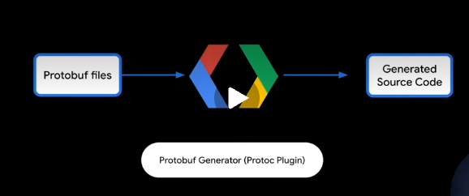
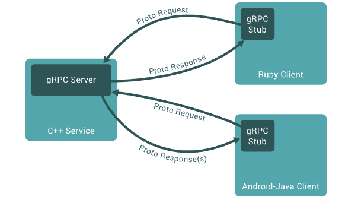

# Introduction to gRPC

영상

```proto
service Greeter {
    rpc SayHello (HelloRequest) returns (HelloReply) {}
}

messages HelloRequest {
    string name = 1
}

messages HelloReply {
    string message = 1
}

```

greeter 라는서비스의 API와 요청 및 응답 메시지 데이터 구조를 정의하는 protobuf 파일이다.

protocol buffers : 구조화된 데이터를 직렬화하여 네트워크를 통해 전송할 수 있도록 하는 쉽고 효율적인 메커니즘이다.
컴파일 시점에 protobuf 생성기는 언어별 런타임 라이브러리와 인터페이스하는 코드와 네트워크 연결을 통해 전송되는 데이터의 직렬화 형식을 생성한다.



생성된 protobuf 소스 코드를 기반으로 gRPC 요청을 처리하는 데모 서비스용 애플리케이션 클래스를 작성한다.
 
```java
static class GreeterImpl extends CreeterGrpc.CreeterImplBase {
    @Override
    public void sayHello (
        HelloRequest req,
        StreamObserver<HelloReply> responseObserver) {
            HelloReply reply = buildReply("Hello " + req.getName());
            responseObserver.onNext(reply);
            responseObserver.onCompleted();
        }
}
```

위의 코드에서는 Hello 라는 문자열을 첨부하고 요청의 이름 필드를 출력한다.

그 다음 서버 애플리케이션을 시작하는 코드를 작성한다.
```java
public static void main(String[] args) throws Excepetion {
    int port = 50051;
    ServiceCredentials credential = InsecureServerCredentials.create();
    Server server = Grpc.newServerBuilderForPort(port, credential)
        .addService(new GreeterImpl()).build().start();
    Runtime.getRuntime().addShutdownHook(new Thread() {
        @Override
        public void run() {
            server.shutdown().awaitTermination(
                30, TimeUnit.SECONDS);
        }
    });
}
```

메인 클래스는 실행이 시작되면 50051 포트에서 클라이언트 연결을 수신하는 gRPC 서버를 시작한다.

마지막으로 클라이언트 측 메인 클래스 코드를 작성한다.
```java
static void main(String[] args) throws Exception {
    String target = "localhost:50051";
    ManagedChannel channel = Grpc.newChannelBuilder(target, InsecureChannelCredentials.create()).build();
    var blockingStub = GreeterGrpc.newBlockingStub(channel);
    HelloRequest request = HelloRequest.newBuilder().setName("cod").build();
    try {
        HelloReply response = blockingStub.sayHello(request);
        logger.info("Greeting: " + response.getMessage());
    } catch (StatusRuntimeException e) {
        logger.log(Level.WARNING, "RPC failed: {0}, e.getStatus());
    }
}
```
위의 코드는 위에서 작성한 gRPC 서버로 gRPC 채널을 통해 요청을 보내고, 응답 데이터를 로그에 기록한다.

gRPC의 기능
- 다양한 언어로 제공된다.
    - 서비스 정의(service definition)와 생성된 코드를 통해 여러 언어간 통신이 가능 -> 각 언어에서 자연스러운 사용 경험을 제공한다.
- 다양한 플랫폼(linux, windows, mobile, ...)
- IETF 표준인 HTTP/2를 기반으로 구축
  - 다양한 로드밸런서 및 프록시와 호환된다.
  - HTTP/2 는 TCP 연결 수를 줄이고, 바이너리 방식을 사용하며, 헤더 압축을 포함한다.
  - 고성능을 지원, 지연 시간을 줄인다.. 리소스 활용도를 높힌다.
- 클라이언트 측 로들밸런싱 지원
  - 필요한 경우 프록시 없이 실행될 수 있다.
  - 관리해야할 구성 요소 수를 줄이고 성능을 향상시킬 수 잇다.
- 서비스 베시에도 적용
  - istio나 google cloud의 traffic director와 같은 중앙 집중식 구성 서비스 검색 서버와 직접 통신할 수 있도록 지원한다.
  - 따라서 사이드카 프록시를 사용하는 번거로움과 비용 없이 메시 네트워크에 참여할 수 잇다.
- grpc는 모니터링 시스템을 지원한다.
  - 이상 시 경고를 받을 수 있음
  - trace system을 지원하여 디버깅에 도움
  - 인터셉터와 같은 도구를 사용하면 인증 및 로깅과 같은 기능을 여러 서비스에서 공유할 수 있다.
- grpc는 스트리밍과 같은 기능 제공
  - 하나의 rpc 내에서 여러 요청과 응답을 주고받을 수 잇다. -> 애플케케리케이션 성능에 맞춰 RPC 구조를 효율적으로 작성 가능


# gRPC 소개

이 페이지에서는 gRPC와 프로토콜 버퍼에 대해 소개합니다. gRPC는 프로토콜 버퍼를 인터페이스 정의 언어( IDL )이자 기본 메시지 교환 형식으로 사용할 수 있습니다. gRPC 또는 프로토콜 버퍼를 처음 접하는 분이라면 이 페이지를 읽어보세요! gRPC를 직접 사용해보고 싶다면 언어를 선택 하고 빠른 시작 가이드를 참조하세요 .

## 개요
gRPC에서는 클라이언트 애플리케이션이 마치 로컬 객체를 호출하는 것처럼 다른 머신에 있는 서버 애플리케이션의 메서드를 직접 호출할 수 있어 분산 애플리케이션 및 서비스를 쉽게 구축할 수 있습니다.
많은 RPC 시스템과 마찬가지로 gRPC는 서비스를 정의하고 원격으로 호출할 수 있는 메서드, 해당 메서드의 매개변수 및 반환 유형을 지정하는 개념을 기반으로 합니다.
서버 측에서는 서버가 이 인터페이스를 구현하고 gRPC 서버를 실행하여 클라이언트 호출을 처리합니다.
클라이언트 측에서는 서버와 동일한 메서드를 제공하는 스텁(일부 언어에서는 단순히 클라이언트라고 함)을 가지고 있습니다. -> 아마 서버에서 호출할 수 있도록 인터페이스를 의미하는 것으로 보임



gRPC 클라이언트와 서버는 Google 내부 서버부터 사용자의 데스크톱에 이르기까지 다양한 환경에서 실행되고 서로 통신할 수 있으며, gRPC에서 지원하는 모든 언어로 작성할 수 있습니다.
예를 들어 Java로 gRPC 서버를 만들고 Go, Python 또는 Ruby로 클라이언트를 쉽게 개발할 수 있습니다.
또한 최신 Google API는 gRPC 버전의 인터페이스를 제공하므로 애플리케이션에 Google 기능을 손쉽게 통합할 수 있습니다.

## Protocol Buffers 사용

기본적으로 gRPC는 프로토콜 버퍼를 사용합니다.
Google에서 개발한 성숙한 오픈 소스 구조화 데이터 직렬화 메커니즘입니다(JSON과 같은 다른 데이터 형식에도 사용할 수 있습니다).
작동 방식에 대한 간단한 소개는 다음과 같습니다. 프로토콜 버퍼에 이미 익숙하신 분은 다음 섹션으로 넘어가셔도 됩니다.

프로토콜 버퍼를 사용할 때 첫 번째 단계는 직렬화할 데이터의 구조를 proto file (확장자 가 `.proto`인 일반 텍스트 파일) 에 정의하는 것입니다.
프로토콜 버퍼 데이터는 *메시지* 구조로 되어 있으며 , 각 메시지는 `field` 라고 하는 이름-값 쌍으로 구성된 작은 논리적 정보 레코드(record)입니다.

```proto
message Person {
    string name = 1;
    int32 id = 2;
    bool has_ponycopter = 3;
}
```

데이터 구조를 지정한 후에는 프로토콜 버퍼 컴파일러(`protoc`)를 사용하여 proto definition 으로부터 원하는 언어로 데이터 접근 클래스를 생성합니다.
이러한 클래스는 각 필드에 대한 간단한 접근자(예: `name()`, `set_name()`)를 제공한다. 또한 structure에서 혹은 raw data로의 serialize/parse를 위한 메서드를 제공한다.
예를 들어, 만약 C++ 을 선택했다면, 위의 예제 코드는 컴파일러를 통해 `Person` 이라는 클래스를 생성해 낼 것이다.
애플리케이션에서 이 클래스를 사용하여 `Person` 이라는 protocol buffer message 들을 populate(채우고), serialize(직렬화), 조회할 수 있다. 

gRPC 서비스는 일반 proto 파일에서 정의하며, RPC 메서드 매개변수와 리턴 타입은 프로토콜 버퍼 메시지로 지정합니다.

```proto
// The greeter service definition
service Greeter {
    // Sends a greeting
    rpc SayHello (HelloRequest) returns (HelloReply) {}
}

// The request message containing the user's name
message HelloRequest {
    string name = 1;
}

// The response message containing the greetings
message HelloReply {
    string message = 1;
}
```

gRPC는 `protoc` 와 특수한 gRPC 플러그인을 사용하여 proto 파일에서 코드를 생성합니다.
생성된 코드는 gRPC 클라이언트 및 서버 코드뿐 아니라 메시지 유형을 채우고 직렬화하고 검색하는 데 사용되는 일반 프로토콜 버퍼 코드도 포함합니다.
프로토콜 버퍼에 대한 자세한 내용과 선택한 언어로 `protoc`와 gRPC 플러그인을 설치하는 방법은 [프로토콜 버퍼 문서](https://protobuf.dev/overview/)를 참조하십시오..

## 프로토콜 버퍼 버전 

프로토콜 버퍼는 이미 오픈 소스 사용자들에게 오랫동안 제공되어 왔으며, 이 사이트의 대부분 예제는 구문이 약간 간소화되고 유용한 새 기능이 추가되었으며 더 많은 언어를 지원하는 protocol buffers 버전 3(proto3)을 사용합니다.
proto3는 현재 Java, C++, Dart, Python, Objective-C, C#, a lite-runtime(Android Java), Ruby 및 JavaScript 프로토콜 버퍼 GitHub 저장소 에서 이용할 수 있습니다.
또한 golang/protobuf 공식 패키지 에 포함된 Go 언어 생성기도 있습니다.
더 많은 언어가 개발 중이며, proto3 언어 가이드 에서 자세한 내용을 확인할 수 있습니다.
자세한 정보를 proto3 language guide 에서 확인할 수 있으며, 각 언어별로 참고 문서가 제공됩니다.
참고 문서에는 `.proto` 파일 형식에 대한 formal한 명세가 포함되어 있다.

일반적으로 proto2(현재 기본 프로토콜 버퍼 버전)를 사용할 수도 있다.
하지만, gRPC에서 지원하는 모든 언어를 사용할 수 있고 proto2 클라이언트와 proto3 서버 간의 통신 혹은 반대 상황에서 발생하는 호환성 문제를 방지할 수 있으므로 gRPC와 함께 proto3를 사용하는 것을 권장합니다.
