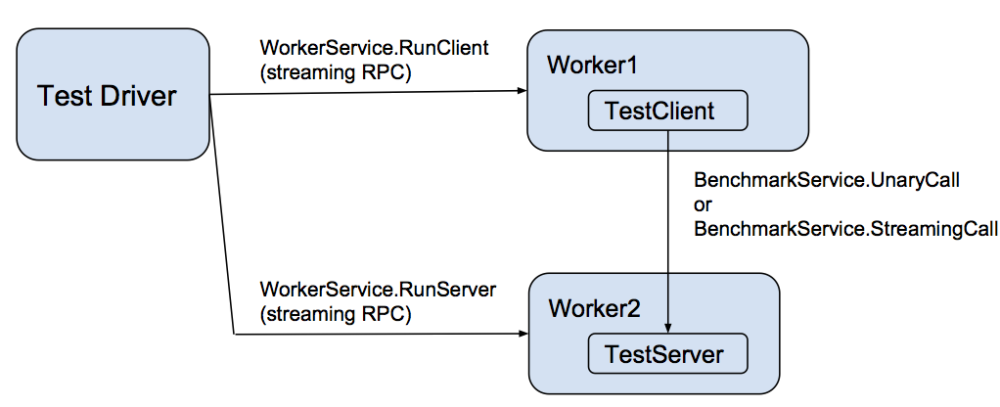

# Benchmarking

gRPC는 여러 언어에서 고성능의 오픈소스 RPC를 지원하도록 설계되었습니다.
이 페이지에서는 다음 내용을 설명합니다.
- 성능 벤치마킹 도구(performance benchmarking tools)
- 테스트에서 고려하는 시나리오(test scenarios)
- 테스트 인프라(testing infrastructure)

## Overview
gRPC는 분산 애플리케이션(distributed applications) 을
고성능(high-performance) 이면서도 높은 생산성(high-productivity) 으로 설계할 수 있도록 만들어졌습니다.
지속적인 성능 벤치마킹(continuous performance benchmarking)은
gRPC 개발 워크플로우에서 매우 중요한 부분입니다.
여러 언어를 대상으로 하는 성능 테스트는
master 브랜치를 기준으로 몇 시간마다 실행되며,

그 결과 수치는 시각화를 위해 대시보드에 보고(report)됩니다.
그리고 제공되는 대시보드는 다음과 같습니다.

Multi-language performance dashboard @master
→ 최신 개발 버전(latest dev version)의 성능 대시보드
Legacy dashboard
→ 위와 동일한 데이터를 제공하는 기존 대시보드

## Performance testing design
각 언어는 성능 테스트용 worker 를 구현하며,
이 worker는 gRPC WorkerService 를 구현합니다.
이 서비스는 worker가 실제 benchmark 테스트를 수행할 때
클라이언트 또는 서버 역할을 하도록 지시합니다.
실제 benchmark 테스트는 BenchmarkService 로 표현되며,

이 서비스에는 두 개의 메서드가 있습니다.
- UnaryCall
  → 응답으로 반환할 바이트 수(number of bytes)를 지정하는 단순 요청(simple request)에 대한 unary RPC
- StreamingCall
  → UnaryCall 과 유사하지만,
  요청과 응답 메시지를 반복적으로 ping-pong 방식으로 주고받을 수 있는 streaming RPC

이러한 worker들은 driver 에 의해 제어됩니다.
driver는 다음 두 가지를 입력으로 받습니다.
- 시나리오 설명(scenario description)
  → JSON 형식으로 제공됨
- 각 worker 프로세스의 host:port 를 지정하는 환경 변수(environment variable)

## Languages under test
다음 언어들은 master 브랜치 기준으로,
클라이언트와 서버 양쪽 역할 모두에 대해 지속적인 성능 테스트(continuous performance testing) 가 수행됩니다.
C++, Java, Go, C#, Node.js, Python, Ruby

성능 테스트에서 각 언어가 클라이언트 측과 서버 측 역할을 모두 수행하는 것에 더해, 모든 언어는 다음 방식으로도 테스트됩니다.
- C++ 서버를 대상으로 클라이언트 역할 수행
- C++ 클라이언트를 대상으로 서버 역할 수행

이 테스트의 목적은, 다른 한쪽의 성능 영향을 배제한 상태에서 특정 언어의 클라이언트 구현 또는 서버 구현이 낼 수 있는 현재 성능 상한선(upper bound) 을 확인하는 것입니다.

PHP나 모바일 환경은 gRPC 서버를 지원하지 않기 때문에(성능 테스트에는 gRPC 서버가 필요함) 직접적인 성능 테스트 구성이 어렵습니다.
대신, 다른 언어로 작성된 proxy WorkerService 를 사용하여 클라이언트 측 성능을 벤치마킹할 수 있습니다.

## Scenarios under test
테스트되고 있으며 위 대시보드에 표시되는 중요한 시나리오는 여러 가지가 있으며, 그중 대표적인 것은 다음과 같습니다.
- Contentionless latency
  → 단 하나의 클라이언트만 존재하고,
  한 번에 하나의 메시지만 StreamingCall 로 전송하는 상황에서 측정되는
  중앙값(median) 및 tail 응답 지연 시간(response latency)
- QPS (Queries Per Second)
  → 2개의 클라이언트가 있고, 총 64개의 채널을 사용하며,
  각 채널마다 동시에 100개의 outstanding message를 StreamingCall 로 보내는 상황에서의
  초당 메시지 처리량(messages/second)
- Scalability (일부 언어 대상)
  → 서버 코어(core) 하나당 처리 가능한 초당 메시지 수(messages/second per server core)

대부분의 성능 테스트는 보안 통신(secure communication) 과 protobuf 를 사용하여 수행됩니다.
다만 일부 C++ 테스트에서는, 최대 성능(peak performance)을 보여주기 위해 추가적으로 다음도 사용합니다.
- 비보안 통신(insecure communication)
- generic API (protobuf를 사용하지 않는 API)
그리고 앞으로 추가적인 시나리오가 더해질 수 있습니다.

## Testing infrastructure
모든 성능 벤치마크는 전용 GKE 클러스터(dedicated GKE cluster) 에서 실행됩니다.
각 benchmark worker(클라이언트 또는 서버)는 우리의 worker pool 중 하나에서 서로 다른 GKE 노드에 스케줄링됩니다.
그리고 각 GKE 노드는 별도의 GCE VM 입니다.
benchmark framework 소스코드는 공개되어 있으며, test-infra GitHub repository 에서 확인할 수 있습니다.

대부분의 테스트 인스턴스는 8코어 시스템이며, 이 인스턴스들은 latency 측정과 QPS 측정 모두에 사용됩니다.
그리고 C++ 와 Java 에 대해서는 추가로 32코어 시스템에서의 QPS 테스트 도 지원합니다.

그리고 모든 QPS 테스트에서는, 서버 1대당 동일한 클라이언트 머신 2대를 사용합니다.
QPS 측정이 client 성능 한계(client-limited)에 막히지 않도록 하기 위해서입니다.
