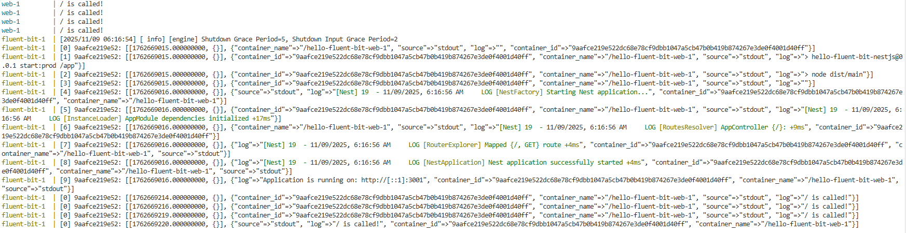
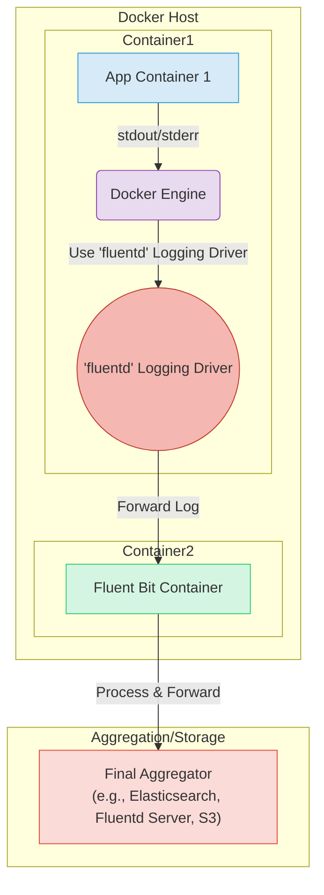

## 목적

docker 환경에서 특정 컨테이너에서 발생한 로그를 fluent-bit 이 구동되는 컨테이너로 전달하고 이를 출력합니다.

### docker compose 를 사용한 실행

**컨테이너 실행**

```shell
docker compose up -d
```

**서버 호출(로그 추가적으로생성하기위해) - 선택**

```shell
curl localhost:4000
```

**log 확인**

```shell
docker compose logs
```

nestjs 애플리케이션에서 표준 출력으로 출력한 로그가 fluent-bit 에 의해 표준 출력된 로그에도 포함되어 있는 것을 확인할 수 있습니다.


**컨테이너 일괄 종료**

```shell
docker compose down -v
```

## 주의할 점

- 동일한 도커 네트워크로 연결하면 안되는 것으로 보입니다(fluent-bit 은 host 네트워크사용).
- docker 를 사용할 때만 fluentd 드라이버를 제공하는 것 같습니다. podman 은 제공하지 않습니다.
- fluent-bit 의 conf 가 제대로 먹지 않았을 때, cpu 를 측정합니다.
- pnpm 도커파일 생성할 때 설정이 조금 다릅니다.

## 내부동작에 대한 개인 생각



docker engine 이 logger 로 fleuntd 구현체를 사용한다. 따라서 fluentd 로그 구현체가 stdout, stderr 을 캡쳐하여 로그를 생성한다.
해당 로그를 생성해서 aggregator 로 forward 한다.
aggregator 는 로그 데이터를 받고 출력한다.

- [fluentd log driver](https://github.com/fluent/fluent-logger-golang/blob/master/fluent/fluent.go)
- [fluentd log driver](https://www.fluentd.org/guides/recipes/docker-logging)
- [fluentd log driver](https://docs.docker.com/engine/logging/drivers/fluentd/)
- [containerd log driver](https://github.com/containerd/nerdctl/issues/1039)

## TODO

- podman 에서는 logging driver 에 fluentd 가 포함되어 있지 않습니다. 또한 일반적인 k8s 환경에서 logging driver 는 json-file 인 것으로 알고 있는데, 적용할 수 있는 방법 고안
- output 을 aws service 로 변경

### 추가 CLI 명령어 사용

**nestjs app 단독 실행**

```shell
docker run -d -p 4000:3001 --name hello-fluent-bit hello-fluent-bit:1.0.0
```

**nestjs app 빌드**

```shell
docker build --no-cache -t hello-fluent-bit:1.0.0 .
```

https://docs.fluentd.org/container-deployment/docker-compose
