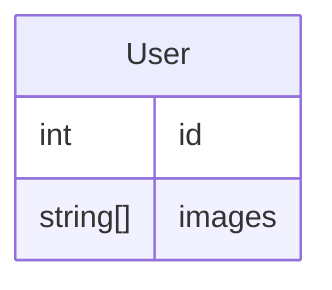

## 목표

- prisma 에서 scalar 배열을 어떻게 다루는지 확인합니다.
- 엔티티를 생성할 때 scalar 배열에 대해 undefined 이면 실제 데이터는 null 로 저장되지만, 조회 시 어떤 타입으로 조회하는지 확인합니다.

### 테스트 실행

**패키지 설치**

```shell
npm i
```

**테스트 실행**

```shell
npm test
```

### 테이블 구조



### case1 문자열 배열을 사용할 때 prisma 의 api 를 사용하는 경우

1. `images` 컬럼이 null 인 user 를 생성합니다.
2. 생성한 user 를 prisma api 를 통해 조회합니다.

```ts
// images 컬럼이 null 인 user 생성
const createdUser = await prisma.user.create({
  data: {},
});

// 생성한 user prisma api 로 조회
const user = await prisma.user.findUnique({
  where: {
    id: createdUser.id,
  },
});

// {id: 1, images: []}
console.log(user);
```

`images` 필드가 빈 배열임을 확인할 수 있습니다.

### case2 문자열 배열을 사용할 때 native query 를 사용하는 경우

1. `images` 컬럼이 null 인 user 를 생성합니다.
2. 생성한 user 를 native query 로 조회합니다.

```ts
// images 컬럼이 null 인 user 생성
const createdUser = await prisma.user.create({
  data: {},
});

// 생성한 user prisma api 로 조회
const [user] = await prisma.$queryRaw<
  User[]
>`select * from "User" where id = ${createdUser.id}`;

// {id: 1, images: null}
console.log(user);
```

`images` 필드가 null 임을 확인할 수 있습니다.
